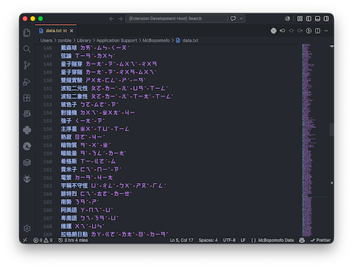

# McBopomofo Data Editor for VS Code



This extension provides syntax highlighting for McBopomofo `data.txt` and `excluded-phrases.txt` files.

## Features

- Syntax highlighting for comments (starting with `#`).
- Validation for data lines (`Phrase Bopomofo-Sequence`).
- Marking invalid lines.

## Syntax Rules

- **Comments**: Lines starting with `#`.
- **Valid Data**: `Phrase` followed by a space and a `Bopomofo-Sequence` (syllables connected by `-`) or an English macro (starting with `_`).
- **Invalid Lines**: Any line that doesn't follow the above rules.

## Installation

### Install from VSIX (local install)

1. Install dependencies:

	```bash
	npm install
	```

2. Package the extension:

	```bash
	npx @vscode/vsce package
	```

3. This creates a `.vsix` file in the project root, for example:

	`mcbopomofo-vscode-extension-0.1.0.vsix`

4. Install the `.vsix`:

	- In VS Code: run **Extensions: Install from VSIX...** from the Command Palette.
	- Or via CLI:

	  ```bash
	  code --install-extension mcbopomofo-vscode-extension-0.1.0.vsix
	  ```

5. Reload VS Code after installation.

## Publish to Visual Studio Marketplace

1. Create a publisher and get a Personal Access Token (PAT):

	- Publisher: <https://marketplace.visualstudio.com/manage>
	- PAT: <https://dev.azure.com>

2. Login with `vsce`:

	```bash
	npx @vscode/vsce login <publisher-name>
	```

3. Publish the current version:

	```bash
	npx @vscode/vsce publish
	```

4. Or bump and publish in one command:

	```bash
	npx @vscode/vsce publish patch
	```

5. After publishing, users can install it from the Extensions Marketplace by searching:

	`McBopomofo Data Editor`

## Development and Testing

1. Open this repository in Visual Studio Code.
2. Press `F5` to open a new window with the extension loaded ("Extension Development Host").
3. In the new window, open the provided `test_data.txt` file (or create a file named `data.txt` or `excluded-phrases.txt`).
4. You should immediately see the syntax highlighting applied.
5. **Making Changes:** If you modify the `syntaxes/mcbopomofo-data.tmLanguage.json` file, you need to reload the Extension Development Host window to see the changes. You can do this by opening the Command Palette (`Cmd+Shift+P` on macOS, `Ctrl+Shift+P` on Windows/Linux) in the test window and selecting **Developer: Reload Window**, or simply by pressing `Cmd+R` (`Ctrl+R`).

## Compatibility

This extension is built for Visual Studio Code, but because it is a standard TextMate grammar extension, it is fully compatible with various editors and IDEs forked from or based on VS Code, such as:

- **VSCodium**: A community-driven, telemetry-free distribution of VS Code.
- **Cursor**: An AI-powered code editor built on top of VS Code.
- **Windsurf**: Another modern AI-driven IDE based on the VS Code architecture.
- **Antigravity**: Google's AI-first agentic IDE, built as a fork of VS Code.
- **Trae**: An adaptive AI IDE built on VS Code.
- **GitHub Codespaces / Gitpod**: Web-based VS Code environments.
